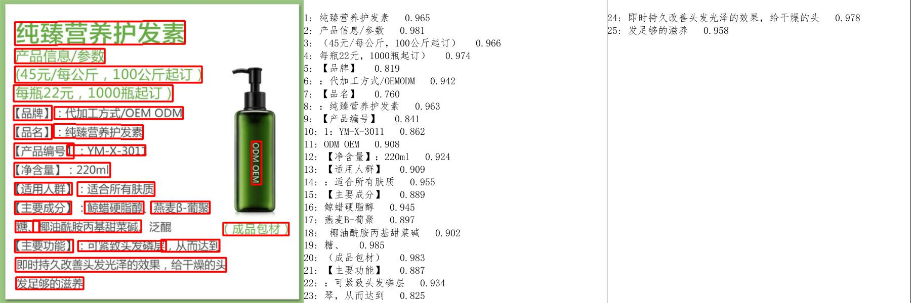

# ocr-paddleocr

- [PaddleOCR 百度飞浆](https://github.com/PaddlePaddle/PaddleOCR)
- [install-paddlepaddle](https://github.com/PaddlePaddle/PaddleOCR/blob/release/2.6/doc/doc_en/quickstart_en.md#11-install-paddlepaddle)

**说明**

PaddleOCR(百度飞桨OCR)旨在打造一套丰富、领先、实用的OCR工具库，帮助开发者训练出更好的模型，并应用落地。
基于PaddlePaddle的超棒多语言OCR工具包（实用的超轻量级OCR系统，支持80+语言识别，提供数据标注和合成工具，支持在服务器、移动、嵌入式和物联网设备之间训练和部署）。

## 安装

### 1.1 安装PaddlePaddle

>
如果您没有基础的Python运行环境，请参考[运行环境准备](https://gitee.com/paddlepaddle/PaddleOCR/blob/release/2.6/doc/doc_ch/environment.md)。

您的机器是CPU，请运行以下命令安装

```shell
python3 -m pip install paddlepaddle -i https://mirror.baidu.com/pypi/simple
```

您的机器安装的是CUDA9或CUDA10，请运行以下命令安装

```shell
python3 -m pip install paddlepaddle-gpu -i https://mirror.baidu.com/pypi/simple
```

### 1.2 安装PaddleOCR whl包

```shell
pip install paddlepaddle paddleocr
```

## 实例

> PaddleOCR提供了一系列测试图片，,
> 点击这里[下载-ppocr_img.zip](https://paddleocr.bj.bcebos.com/dygraph_v2.1/ppocr_img.zip)
> 并解压，然后在终端中切换到相应目录

```shell
cd /path/to/ppocr_img
```

### 1. 通过命令行使用PaddleOCR识别

#### 1.1 中英文模型

* 识别单个图像提取文字

> 检测+方向分类器+识别全流程：--use_angle_cls true设置使用方向分类器识别180度旋转文字，--use_gpu false设置不使用GPU

```shell
# 单个图像
paddleocr --image_dir ./imgs/11.jpg --use_angle_cls true --use_gpu false
```

结果是一个list，每个item包含了文本框，文字和识别置信度

```text
[[[28.0, 37.0], [302.0, 39.0], [302.0, 72.0], [27.0, 70.0]], ('纯臻营养护发素', 0.9658738374710083)]
......
```

* 识别单个PDF提取文字

> paddleocr也支持输入pdf文件，并且可以通过指定参数page_num来控制推理前面几页，默认为0，表示推理所有页。

```shell
paddleocr --image_dir ./xxx.pdf --use_angle_cls true --use_gpu false --page_num 2
```

* 单独使用检测：设置--rec为false (未成功)

```shell
paddleocr --image_dir ./imgs/11.jpg --rec false 
```

结果是一个list，每个item只包含文本框

```text
[[27.0, 459.0], [136.0, 459.0], [136.0, 479.0], [27.0, 479.0]]
[[28.0, 429.0], [372.0, 429.0], [372.0, 445.0], [28.0, 445.0]]
......
```

* 单独使用识别：设置--det为false (未成功)

```shell
paddleocr --image_dir ./imgs_words/ch/word_1.jpg --det false
```

结果是一个list，每个item只包含识别结果和识别置信度

```text
['韩国小馆', 0.994467]
```

##### 1.2 多语言模型

> 介绍语言模型:   
> 语言模型版本说明: paddleocr默认使用PP-OCRv3模型(--ocr_version PP-OCRv3)，如需使用其他版本可通过设置参数--ocr_version，具体版本说明如下：

| 版本名称	     | 版本说明                      |
|-----------|---------------------------|
| PP-OCRv3	 | 支持中、英文检测和识别，方向分类器，支持多语种识别 |
| PP-OCRv2	 | 支持中英文的检测和识别，方向分类器，多语言暂未更新 |
| PP-OCR	   | 支持中、英文检测和识别，方向分类器，支持多语种识别 |

如需新增自己训练的模型，可以在[paddleocr](https://gitee.com/paddlepaddle/PaddleOCR/blob/release/2.6/paddleocr.py)
中增加模型链接和字段，重新编译即可。

更多whl包使用可参考[whl包文档](https://gitee.com/paddlepaddle/PaddleOCR/blob/release/2.6/doc/doc_ch/whl.md)

PaddleOCR目前支持80个语种，可以通过修改--lang参数进行切换，对于英文模型，指定--lang=en。

```shell
paddleocr --image_dir ./imgs_en/254.jpg --lang=en
```

常用的多语言简写包括：

| 语种   | 缩写          |      | 语种   | 缩写     |      | 语种   | 缩写     |
|------|-------------|------|------|--------|------|------|--------|
| 中文   | ch          |      | 法文   | fr     |      | 日文   | japan  |
| 英文   | en          |      | 德文   | german |      | 韩文   | korean |
| 繁体中文 | chinese_cht |      | 意大利文 | it     |      | 俄罗斯文 | ru     |

全部语种及其对应的缩写列表可查看[多语言模型教程](https://gitee.com/paddlepaddle/PaddleOCR/blob/release/2.6/doc/doc_ch/multi_languages.md)

#### 2. Python脚本使用PaddleOCR识别

> 通过Python脚本使用PaddleOCR whl包，whl包会自动下载ppocr轻量级模型作为默认模型。

##### 2.1 中英文与多语言使用

* 识别图像

> 检测+方向分类器+识别全流程

```python
from paddleocr import PaddleOCR, draw_ocr

# Paddleocr目前支持的多语言语种可以通过修改lang参数进行切换
# 例如`ch`, `en`, `fr`, `german`, `korean`, `japan`
ocr = PaddleOCR(use_angle_cls=True, lang="ch")  # need to run only once to download and load model into memory
img_path = 'doc/imgs/11.jpg'
result = ocr.ocr(img_path, cls=True)
for idx in range(len(result)):
    res = result[idx]
    for line in res:
        print(line)

# 显示结果
# 如果本地没有simfang.ttf，可以在doc/fonts目录下下载
from PIL import Image

result = result[0]
image = Image.open(img_path).convert('RGB')
boxes = [line[0] for line in result]
txts = [line[1][0] for line in result]
scores = [line[1][1] for line in result]
im_show = draw_ocr(image, boxes, txts, scores, font_path='doc/fonts/simfang.ttf')
im_show = Image.fromarray(im_show)
im_show.save('result.jpg')
```

结果是一个list，每个item包含了文本框，文字和识别置信度

```text
[[[28.0, 37.0], [302.0, 39.0], [302.0, 72.0], [27.0, 70.0]], ('纯臻营养护发素', 0.9658738374710083)]
......
```

结果可视化:


* 识别PDF文件

```python
from paddleocr import PaddleOCR, draw_ocr

# Paddleocr目前支持的多语言语种可以通过修改lang参数进行切换
# 例如`ch`, `en`, `fr`, `german`, `korean`, `japan`
# 通过指定参数page_num来控制推理前面几页，默认为0，表示推理所有页。
ocr = PaddleOCR(use_angle_cls=True, lang="ch",
                page_num=0)  # need to run only once to download and load model into memory
pdf_path = 'doc/pdf/2.pdf'
result = ocr.ocr(pdf_path, cls=True)
for idx in range(len(result)):
    res = result[idx]
    for line in res:
        print(line)

# 显示结果
import fitz
from PIL import Image
import cv2
import numpy as np

imgs = []
with fitz.open(pdf_path) as pdf:
    for pg in range(0, pdf.page_count):
        page = pdf[pg]
        mat = fitz.Matrix(2, 2)
        pm = page.get_pixmap(matrix=mat, alpha=False)
        # if width or height > 2000 pixels, don't enlarge the image
        if pm.width > 2000 or pm.height > 2000:
            pm = page.get_pixmap(matrix=fitz.Matrix(1, 1), alpha=False)

        img = Image.frombytes("RGB", [pm.width, pm.height], pm.samples)
        img = cv2.cvtColor(np.array(img), cv2.COLOR_RGB2BGR)
        imgs.append(img)
for idx in range(len(result)):
    res = result[idx]
    image = imgs[idx]
    boxes = [line[0] for line in res]
    txts = [line[1][0] for line in res]
    scores = [line[1][1] for line in res]
    im_show = draw_ocr(image, boxes, txts, scores, font_path='doc/fonts/simfang.ttf')
    im_show = Image.fromarray(im_show)
    im_show.save('result_page_{}.jpg'.format(idx))
```

**小结**

通过本节内容，相信您已经熟练掌握PaddleOCR whl包的使用方法并获得了初步效果。

PaddleOCR是一套丰富领先实用的OCR工具库，打通数据、模型训练、压缩和推理部署全流程，您可以参考[文档教程](https://gitee.com/paddlepaddle/PaddleOCR/blob/release/2.6/README_ch.md#%E6%96%87%E6%A1%A3%E6%95%99%E7%A8%8B)
，正式开启PaddleOCR的应用之旅。

## Q&A 问题汇总记录

Q：运行报错：ModuleNotFoundError: No module named 'paddle'

缺少安装 paddlepaddle、paddleocr 模块

```shell
pip install paddlepaddle paddleocr
```